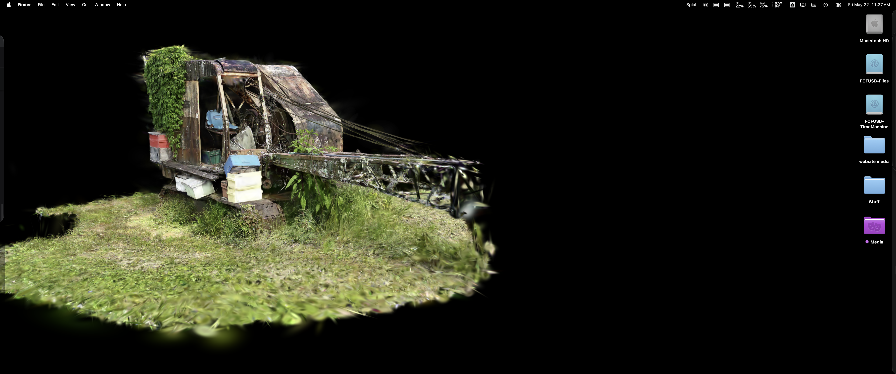

# Splat Wallpaper Engine

Interactive macOS desktop wallpaper for Gaussian splats.



The goal is a menu-bar Mac app that renders a local Gaussian splat as the desktop background, then lets the user temporarily interact with it by orbiting, panning, zooming, and saving a new default camera angle.

## MVP

- Load an existing local `.sog` splat.
- Keep `.ply` files as source/archive assets, not runtime assets.
- Render the splat in a desktop-level borderless window.
- Toggle interaction mode from the menu bar or a hotkey.
- Toggle slow rotation from the menu bar.
- Open a local `.sog` scene from the menu.
- Save the active camera view.
- Pause or reduce frame rate when not interacting.

## Preferred Asset Flow

```text
Gaussian Splat PLY source -> SOG runtime derivative -> desktop renderer
```

`.sog` is the preferred runtime format because it is compact and already fits Monroe's `monroe.space` publishing flow. `.spz` and `.ksplat` remain fallback candidates if renderer support is better in a chosen library.

## First Technical Bet

Start with a Swift/AppKit shell that owns the desktop-level window, then embed the proven SuperSplat web viewer from `monroe.space`. Once the user experience is validated, decide whether to keep the web renderer or replace it with a native Metal renderer.

## Run

```bash
swift run
```

Use the menu-bar `Splat` item to:

- open a `.sog` scene;
- show or hide the wallpaper window;
- toggle interaction mode;
- toggle slow rotation.

## Links

- GitHub: https://github.com/StoneHub
- Personal site: https://monroes.tech

## License

Splat Wallpaper Engine is licensed under the Apache License, Version 2.0. Apache-2.0 is permissive like MIT, but includes an explicit patent grant from contributors.

The bundled renderer includes MIT-licensed SuperSplat/PlayCanvas code from PlayCanvas Ltd.; see `NOTICE`.
