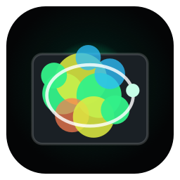
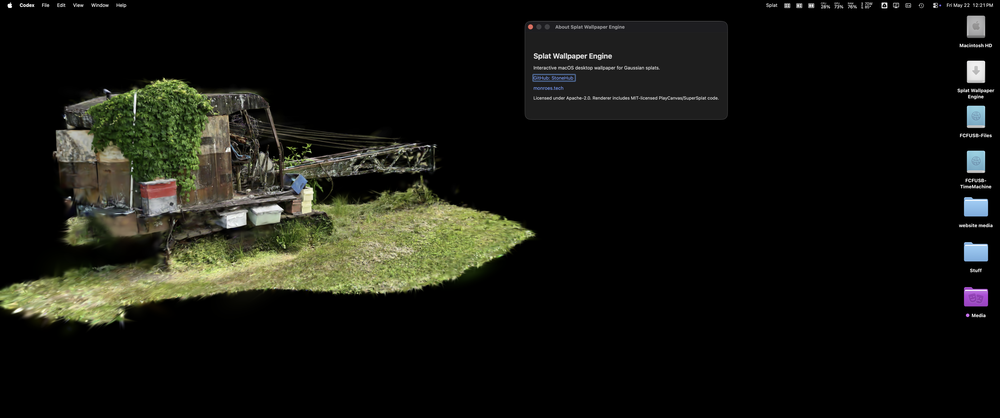
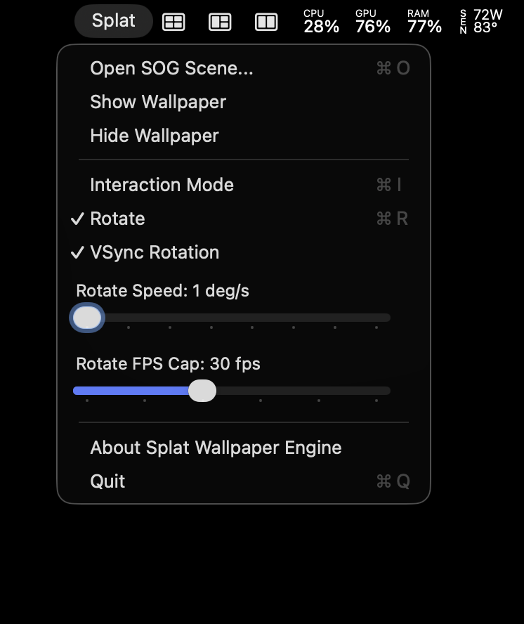

# Splat Wallpaper Engine

Archived prototype for an interactive macOS desktop wallpaper for Gaussian
splats.

## Project Status

This repository is now a public landing and migration page for the original
Splat Wallpaper Engine prototype. The working direction has moved to a native
SwiftUI and Metal successor app, `gsplat`, which includes the macOS Splatpaper
wallpaper mode and broader iPhone/iPad viewer targets.

The original app here remains useful as historical reference:

- AppKit menu-bar wallpaper window behavior.
- WebKit/SuperSplat `.sog` rendering prototype.
- Windows tray/WebView2 prototype notes.
- Packaging and release history through `v0.1.7`.

For new work, use the native Metal app instead of extending this WebKit-based
renderer.

Successor repo:

- `benwilliams0540/gsplat`

Note: `gsplat` is private at the time this README was updated. This repo does
not vendor or relicense any of that code.

<p align="center">
  
</p>






The original goal was a menu-bar Mac app that renders a local Gaussian splat as
the desktop background, then lets the user temporarily interact with it by
orbiting, panning, zooming, and saving a new default camera angle.

## Migration Notes

Use this repo for reference only. The main architectural replacement is:

```text
Splat Wallpaper Engine
  AppKit menu-bar shell
  WKWebView
  bundled SuperSplat viewer
  .sog only at runtime

gsplat / Splatpaper
  SwiftUI app shell
  MTKView
  native Metal renderer
  .ply, .sog, .splat, .spz imports
  macOS wallpaper mode plus iOS/iPadOS viewer targets
```

If this project is revived publicly, the safest path is not to copy private
source from `gsplat`. Instead, first settle licensing and contribution ownership,
then either:

1. Move the public app to the successor repo.
2. Extract a properly licensed renderer package from the successor.
3. Keep this repo archived and point releases/users to the successor.

## MVP

- Load an existing local `.sog` splat.
- Keep `.ply` files as source/archive assets, not runtime assets.
- Render the splat in a desktop-level borderless window.
- Toggle interaction mode from the menu bar or a hotkey.
- Toggle in-place splat rotation from the menu bar with speed, FPS cap, and VSync controls.
- Open a local `.sog` scene from the menu.
- Save the active camera view.
- Pause or reduce frame rate when not interacting.

## Preferred Asset Flow

```text
Gaussian Splat PLY source -> SOG runtime derivative -> desktop renderer
```

`.sog` is the preferred runtime format because it is compact and already fits Monroe's `monroe.space` publishing flow. `.spz` and `.ksplat` remain fallback candidates if renderer support is better in a chosen library.

## Historical Technical Bet

Start with a Swift/AppKit shell that owns the desktop-level window, then embed the proven SuperSplat web viewer from `monroe.space`. Once the user experience is validated, decide whether to keep the web renderer or replace it with a native Metal renderer.

That decision has now been made: the native Metal renderer path is the winner.

## Run the Archived Prototype

### macOS

```bash
swift run
```

Use the menu-bar `Splat` item to:

- open a `.sog` scene;
- show or hide the wallpaper window;
- toggle interaction mode;
- toggle in-place rotation and tune speed, FPS cap, or VSync rendering.

### Windows Prototype

The Windows port is scaffolded under `windows/SplatWallpaperEngine.Win`. It uses WPF, WebView2, a notification-area tray menu, and a Win32 WorkerW desktop attachment service.

```powershell
cd windows\SplatWallpaperEngine.Win
.\sync-renderer.ps1
dotnet restore
dotnet build -c Release
```

See `docs/windows-port-plan.md` for the conversion plan and Windows verification checklist.

## Links

- GitHub: https://github.com/StoneHub
- Personal site: https://monroes.tech

## License

Splat Wallpaper Engine is licensed under the Apache License, Version 2.0. Apache-2.0 is permissive like MIT, but includes an explicit patent grant from contributors.

The bundled renderer includes MIT-licensed SuperSplat/PlayCanvas code from PlayCanvas Ltd.; see `NOTICE`.
